.. Adding labels to the beginning of your lab is helpful for linking to the lab from other pages
.. _abs:

------------------------
Acropolis Block Services
------------------------

Overview
++++++++

Acropolis Block Services (ABS) is Nutanix’s way to have an iSCSI target for bare metal servers. In this exercise we are going to create a iSCSI target and are going to mount this to your Windows 2012 Server. To create this iSCSI target you are going to create so called **Volume Groups** and set the parameters so the Windows 2012 server can connect to it.

Tasks to run:

-	Create a Volume Group in PRISM
-	Add a drive to the Volume Group
-	Set the authentication for iSCSI
-	Set other parameters
-	Mount the Volume Group and format it
-	Put data on the drive
-	Disconnect the iSCSI target

Setting up ABS
--------------

Login to PRISM and open the **Storage Home** View. Then click on the **+ Volume Group**.

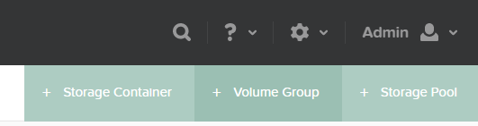

Provide the **Name, iSCSI Target Name Prefix, Description** and click on **Add New Disk**.

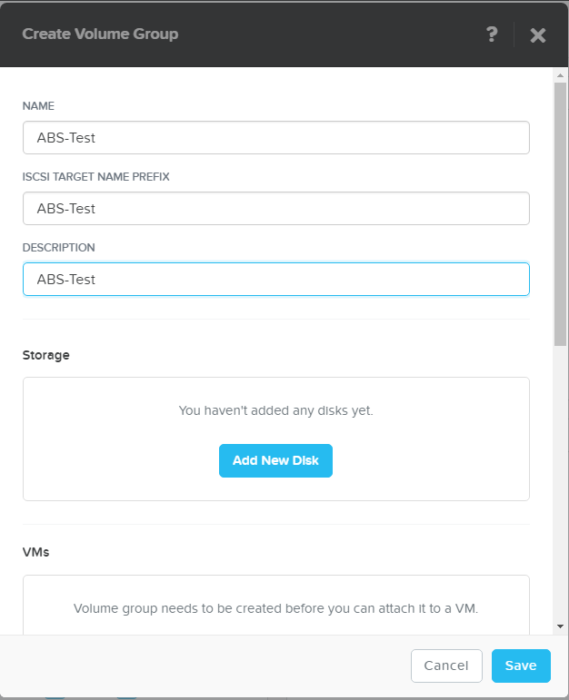

Provide the storage container to be used and set the size to **10GB**. And click **Add**.

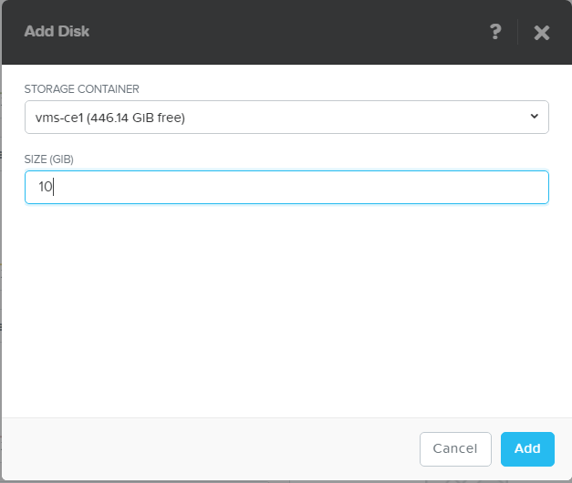

In the next screen provide the settings for the **Access Settings**. If you want to use CHAP Authentication, select the Checkbox and provide the “CHAP” passphrase. We are going to do this without CHAP. Click on the **Add New Client** Button to add an allow connection from setting.

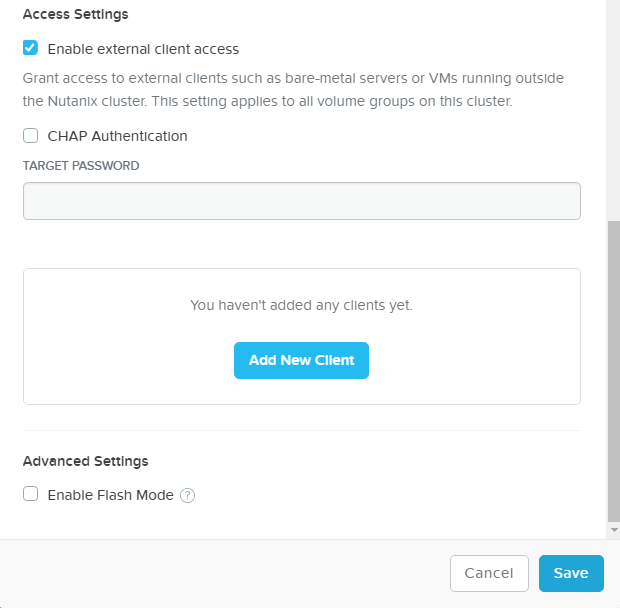

Since version 5.0 you can just use the IP address of the server that is allowed to connect to this iSCSI Target. For mutual CHAP authentication, check the **CHAP Authentication** checkbox and provide the passphrase. We are not going to use to for now.

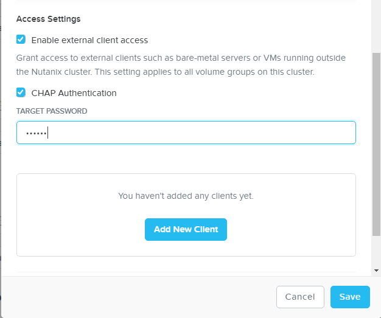

Click the **Add New Client** button

The added server’s IP address or IQN should be mentioned like the screenshot below. Click the **Add** button to add the iSCSI client for access.

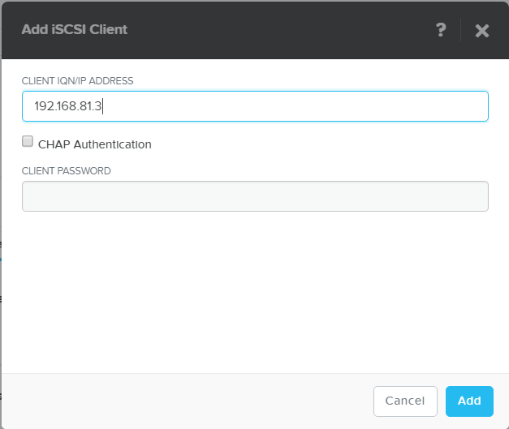

The PRISM interface should show something like the below.

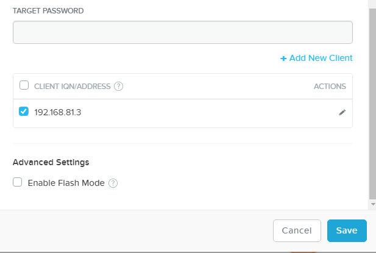

If the iSCSI drives needs to be "pinned to flash" select the **Enable Flash Mode** under **Advance Settings**.

After clicking on the **Save** button PRISM will show a notification bar like below.

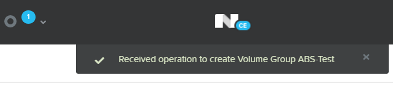

When clicking on the donut icon at the top of the screen, there should be a task named like below. Make sure it is green (100%) before you move on…

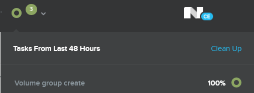

Using the ABS
-------------

Login to the Windows 2012 server via RDP, press the **Windows Start** button and do a search for **iscsi** then the **iscsi initiator** should pop up like below and select it.

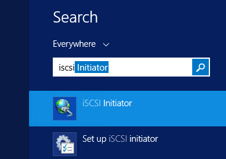

The iSCSI initiator needs to have an IP address of the cluster. This IP address is the **EXTERNAL DATA SERVICES IP ADDRESS**. This can be found on the following by opening PRISM and click on the name of the cluster in the top left corner. You should see something like the below screenshot.

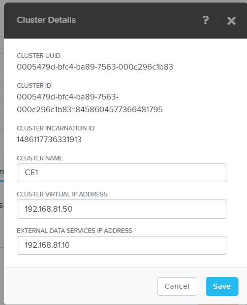

In the iSCSI Initiator screen type, the IP address of the cluster. In this example it is **192.168.81.10**. That IP address must be filled in at the **Target** field in the iSCSI initiator.

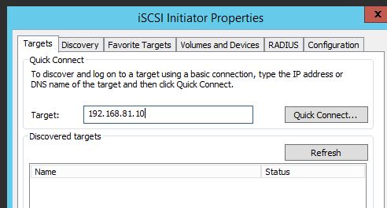

Click **Quick Connect...** to connect to the cluster over iSCSI

If all was configured correctly, the **Discovered targets** should show the Prefix of the Volume Group (abs-test-xxxxxxx) with a status of connected.

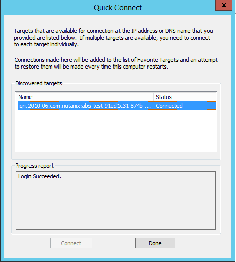

Now open the Server manager and create a new volume on the just connected iSCSI connection and format the drive using the normal Windows procedures. In the end you should end up with a drive, example below shows N:, of roughly 10GB.

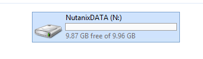

Create some data on the just mounted drive.

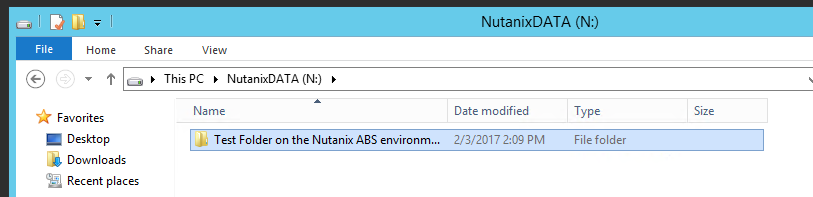
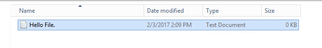

Look in PRISM what the effects are by selecting the **Storage Home View, Volume Groups** and select the earlier created Volume Group **ABS-Test**.

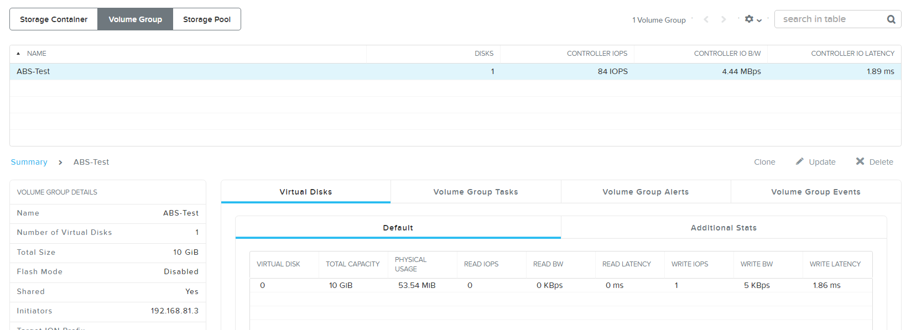

If you are done with the reading, writing, deleting, moving, copying, or whatever actions, disconnect the iSCSI target so we can delete the Volume Group to get some resources freed-up.

Open the iSCSI Initiator again, select the **Target** and click the **Disconnect** button

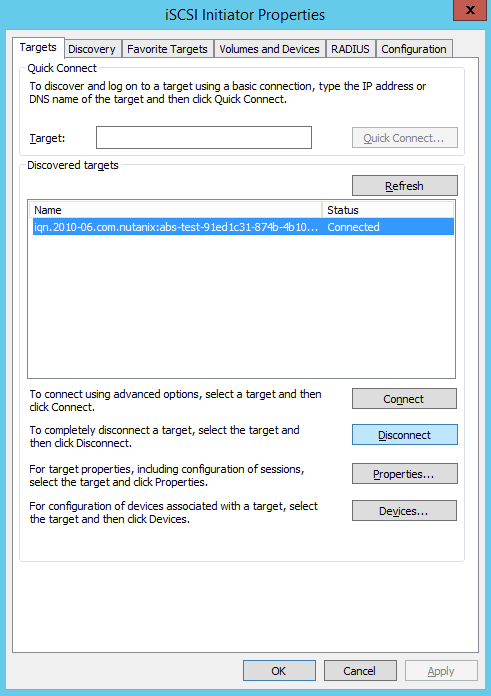

If you receive any errors, just click **Yes**.

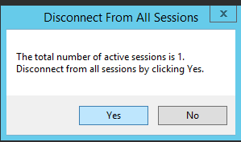

If everything is disconnected and ok, delete the Volume Group in the PRISM interface. Select the Voume Group **ABS-Test** and select **Delete** on the right side of the screen.

------------

Takeaways
+++++++++

- Easy way of creating an iSCSI disk
- Share iSCSI disk as a block device to VMs and Bare Metal machines
- iSCSI Storage convergence into Nutanix
