.. Adding labels to the beginning of your lab is helpful for linking to the lab from other pages
.. _ad_integration:

--------------
AD Integration
--------------

Overview
++++++++

Besides authenticating using the built-in PRISM user database, you can also use the Active Directory integration. THis way admins can use their AD accounts to log into the PRISM interface and get permissions. This module is about setting up the integration, setting cluster roles and login using the created users. After the login you can see what the permissions are for different Cluster Roles.

---------

Authentication
++++++++++++++

On the Windows 2012 server in your environment is also a Domain Controller for your environment. Open the Active Directory Users and Computers and make sure the users according to the below screenshot exist in the SSP OU. If not, create the missing information. The password for the accounts, if you need to create them, is **nutanix/4u**.

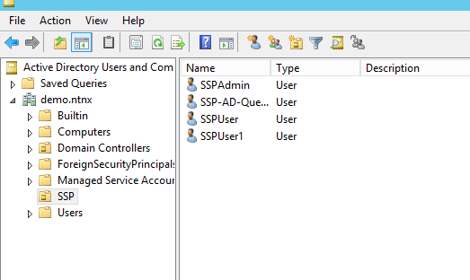

After the check has passed, close the AD interface and open your PRISM interface.

Click on the **Gear Icon** and select **Authentication** to start the setup of using AD for access to the cluster.

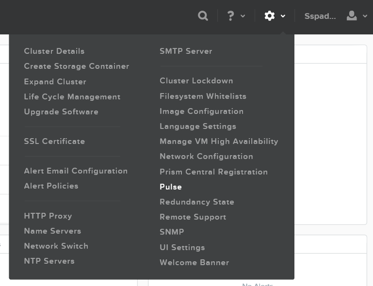

Fill out the open field conform the below screenshot and hit the **Save** button

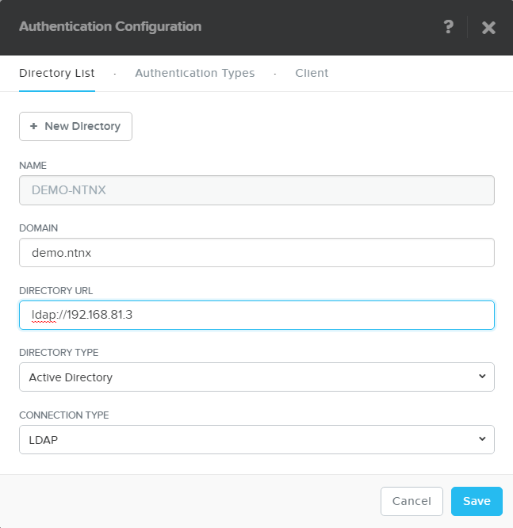

After clicking **Save**, hoover over the Exclamation Mark and click on the blue text **Click here** to create a role mapping.

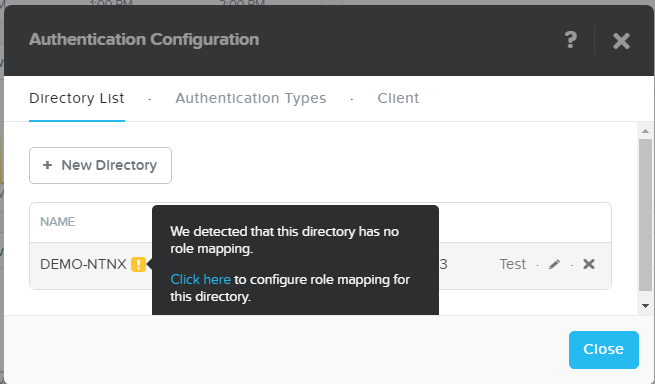

Create a LDAP user role mapping by selecting **User** in the *LDAP TYPE*.

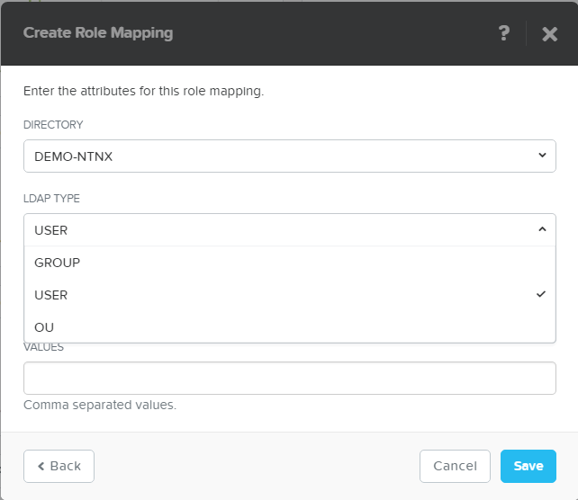

Select **Cluster Admin** in the Role and provide user name **SSPAdmin** in the Values field. Below is a screenshot of the fields filled

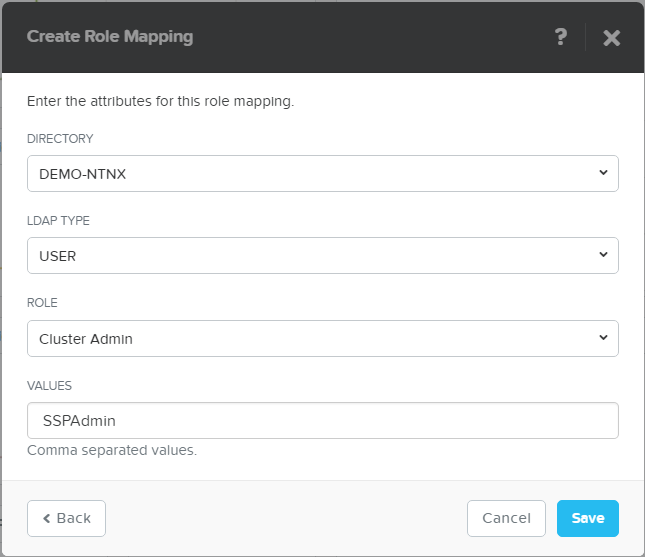
 
Also create a role mapping for the **SSPUser** and the **SSPUser1** user, but then with a role of **Viewer**.

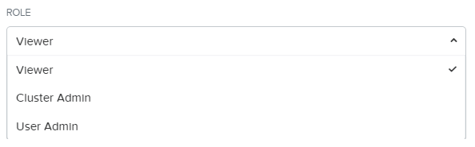

The resulting page should look like the below screenshot.

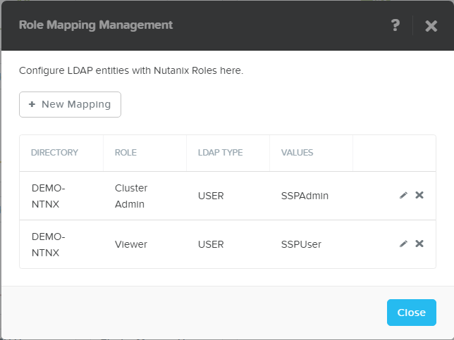

Make sure that under the Authentication TYpes tab, the **Directory Services** has been enabled.

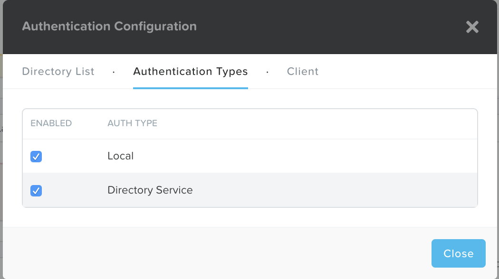

Return to the Authentication section in PRISM and hit the **Test** button. Fill out the fields with the **SSPAdmin** and the corresponding password **nutanix/4u**. After clicking the **Test** button a green bar should be visible in the screen stating the Authentication test was successful

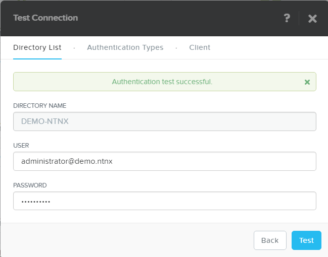

Log out of PRISM, or use another browser to log in to the PRISM using the **SSPAdmin@demo.ntnx** user. The password is **nutanix/4u**.

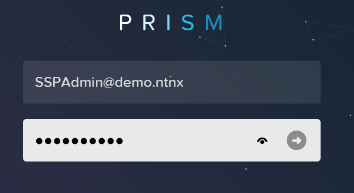

Take a look at the **Gear Icon** what can and can’t be changed

Logout from the PRISM interface and log back in using the **SSPUser@demo.ntnx** and its password **nutanix/4u**. Also see what this user can and can’t do by clicking the **Gear Icon**.

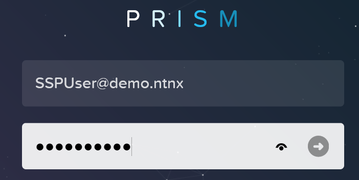
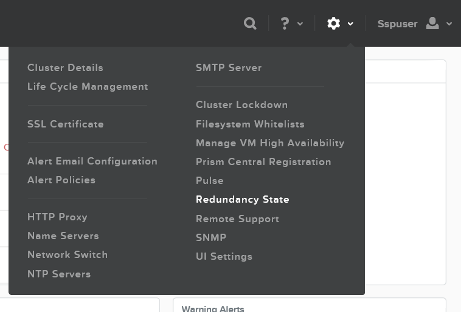

.. note:: Even if *Local* in **AUTH TYPE** has been disabled on the **Authentication Types** tab in the *Authentication Configuration* page, the admin user will **always** be active.

-----------------------------------------------------

Takeaways
+++++++++

- Simple setup of AD Integration from teh PRISM interface
- Use AD authentication to login to the PRISM interface and receive permissions based on Cluster roles
