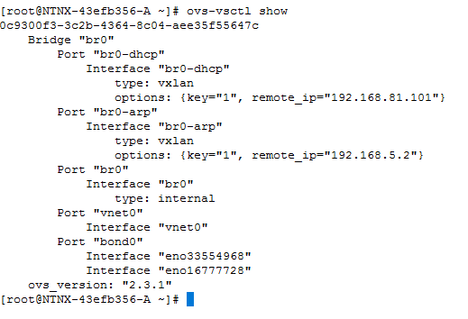
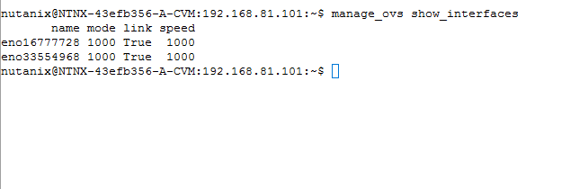
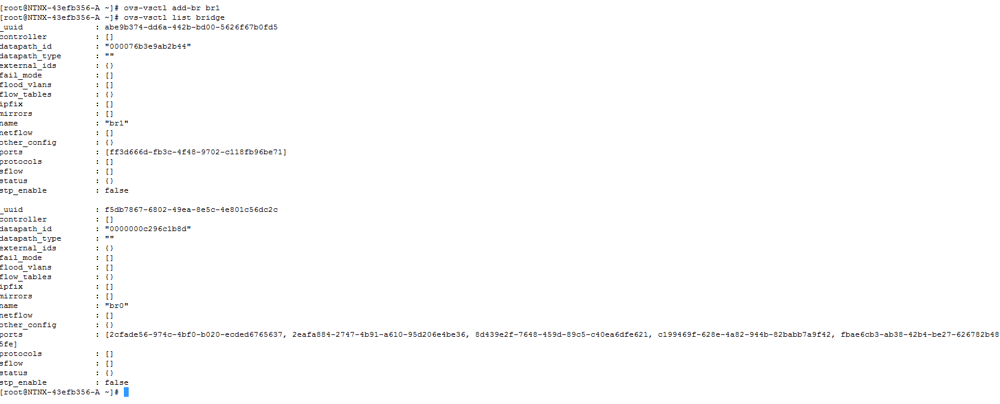
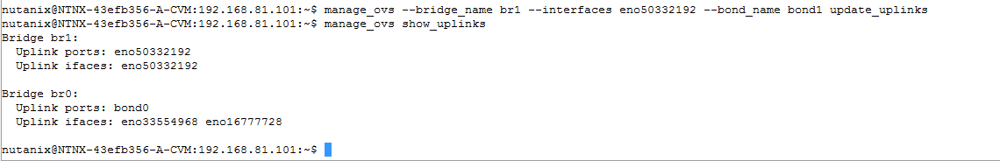
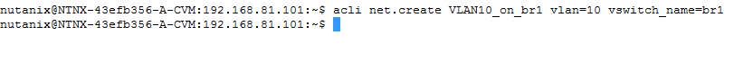
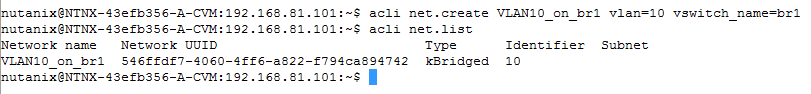
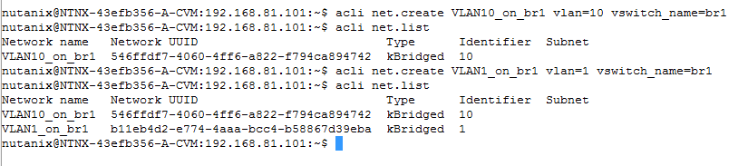
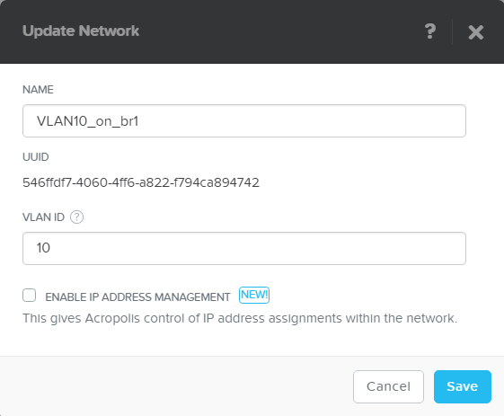

.. Adding labels to the beginning of your lab is helpful for linking to the lab from other pages
.. _adv_networking:

------------------
Advance Networking
------------------

Overview
++++++++

IN this module we are going to manipulate the network using the commndline interface. All of the actions will be run using a SSH connection. This SSH connection is setup using Putty. This tool should already be preinstalled and configured in the Windows DC server you have RDP-ed into.

In this module, you perform the following tasks:

-	Check the current default network configuration
-	Create a new bridge on each AHV host
-	Change the existing bridge to use other network interfaces
-	Create a new bridge (vSwitch)
-	Add interface(s) to the new bridge
-	Create a new network using the new bridge

.. note:: It is a Nutanix Best Practice to manage the AHV environment through PRISM or by using SSH to access the Controller VM. In your environment, avoid connecting directly to the AHV hosts unless you have specific configuration tasks that require it.

Check the current (default) network configuration
-------------------------------------------------

Open a RDP sesion to your Windows landing server. Log in to any Controller VM with SSH using Putty with the credentials provided in your exercise handout.

List the existing bridges for each Nutanix node in the cluster by using the following command:

``allssh ssh root@192.168.5.1 “ovs-vsctl show”``

You should see a single bridge named **br0**.

To view additional network interface information, type the following command:

``allssh manage_ovs show_interfaces``

Write down the names of the interfaces shown from the former command in the below table or on a piece of paper.

=========== ==============
Interface   Interface Name
=========== ==============
Interface 1 (enoxxxxxxxx)
Interface 2 (enoyyyyyyyy)
Interface 3 (enozzzzzzzzz)
=========== ==============

Create a new bridge
-------------------

Create bridge **br1** on each Acropolis host in the cluster by using the following command:

``allssh ssh root@192.168.5.1 “ovs-vsctl add-br br1”``

Change the bridges
------------------

In this task, you create a new bond and move one of the 1GbE NICs on your cluster node(s) from that bond.

In step 3 of the former paragraph, you noted down the names of the interfaces. You are going to remove the last interface from the bond0 by using the following command:

``allsh manage_ovs –bridge_name br0 –bond_name bond0 –interfaces enoxxxxxx,enoyyyyyy update_uplinks``

Verify that this operation has succeeded using the following command:

``allsh manage_ovs –bridge_name br0 show_uplinks``

You should see the following reponse:

``Uplink ports: bond0 Uplink ifaces enoxxxxx enoyyyyyy``

.. note:: When using a production AHV environment, the interface names in the former command don’t have this long name. They will be called eth0,1,2,3. Due to CE the interfaces are called en0xxxxx. When performing the separation of 10g and 1g interfaces from a bond the same function can be accomplished by running the following command: ``allssh manage_ovs –bridge_name br0 –bond_name bond0 –interfaces 10g update_uplinks``. This will remove the 1g NICs from the bond0 in bridge br0.

Add the removed Interface enozzzzzz to the bridge br1 by using the following command:

``allssh manage_ovs –bridge_name br1 –interface enozzzzz update_uplinks``

Verify the br1 has an interface enozzzz assigned to it by running the following command:

``allssh manage_ovs –bridge_name br1 show_uplinks``

You should see the following response:

``Uplink ports: enozzzz``

.. note:: Reason for not seeing a bond is that a bond needs to have a least two NICs. In our environment it only has one and therefore it is not showing any bond.

.. NOTE:: When performing the assigning of 1g interfaces to a bond the same function can be accomplished by running the following command: ``allssh manage_ovs –bridge_name br1 –bond_name bond01–interfaces 1g update_uplinks``. This will connect the 1g NICs to the bond1 in bridge br1.

Verify connectivity to the cluster using the **ping** command where CVM-IP is the IP address of one of the Controller VMs in your cluster. If you cluster is only one node (CE only) try to ping one of the other CE instances in the environment or ping the default gateway. Also you can try to ping the CVM from your desktop.

Create a new network (vlan)
---------------------------

This exercise will create a new network which uses the newly created bridge.

.. NOTE:: Due to a small limitation in the GUI now, the creation of a new network that uses another bridge then br0, must be created via the command line. This will be solved in a newer release of the AOS

In this exercise you are going to create a Network in your assigned AHV environment with the following parameters:

============= ======= =============
Name Network  VLAN ID Bridge to use
============= ======= =============
VLAN10_on_br1 10      br1
============= ======= =============

Log in to any Controller VM with SSH using Putty with the credentials provided in your exercise handout. Create a AHV network by using the following command:

``acli net.create VLAN10_on_br1 vlan=10 vswitch_name=br1``

Verify that the AHV network has been created by running the following command:

``acli net.list``

You should see a response showing your just created network. If you want you can create another network on this new br1 bridge. See below screenshot to create a new vlan on br1 with a name of **VLAN1_on_br1** on bridge br1

 
Return to the PRISM interface. Login in using the provided credentials if you have been logged out. Click on **Gear Icon -> Network Configuration** and see that your network has been created. Click on the **Pencil** behind the name of your network to have a closer more detailed look.

------------

Takeaways
+++++++++

- Manipulation on a scripted manner.
- Create multiple Bridges with their own VLANs
- Manipulate the bridges with respect to thier physical network cards
