.. Adding labels to the beginning of your lab is helpful for linking to the lab from other pages
.. _ilt-stuff:

---------------------------
ILT materials
---------------------------

Overview
++++++++

This part of the workshop is to provide you the guidelines to setup the environment on ESXi virtualization. Reason for this hypervisor is that it can import OVAs quickly. AHV doens't have that supported yet. Also the CE needs to be created in a QCOW2, but that is for futures.

The PowerPoint that goes with this workshop can be downloaded `here <https://docs.google.com/presentation/d/1VolBCQtjmaSiKA1yKL2KCS2nOV-2JSPyjJehZnqGiww/edit?usp=sharing>`_

Setup of the Environment
++++++++++++++++++++++++

The environment consists out of machines which have been created earlier. These machines, their IP addresses and their role are mentioned in the below table.

==========  =================== ===========================================
Name        IP address          Role
==========  =================== ===========================================
DC1         192.168.81.3        Domain Controller and RDP
AHV-CE1     192.168.81.21       First AHV Host
AHV-CE2     192.168.81.22       Second AHV Host
CVM-CE1     192.168.81.31       First CVM/Cluster IP address
CVM-CE2     192.168.81.32       Second CVM/Cluster IP address
VIP-CE1     192.168.81.41       First CE Cluster IP address
VIP-CE2     192.168.81.42       Second CE Cluster IP address
DIP-CE1     192.168.81.51       First CE Cluster Data Services IP address
DIP-CE2     192.168.81.52       Second CE Cluster Data Services IP address
VyOS        192.168.81.254      Router and PAT/NAT router (RDP forwarder)
==========  =================== ===========================================

Getting the VMs
---------------

Most of the VMs will be made available `here <http://www.webjoin.nl/~t320569/CE>`_.
For now CE version 5.6 is only made available. **More will follow soon**.

Creating the VMs from scratch
-----------------------------

If you want to run clean VMs please follow the next steps per VM that will be discussed.

**Windows VM**

The following steps are for installaing and configuring the Windows VM for the environment.

#. Install Windows Server 2012 R2 or higher like you would normally do.
#. Change the name to DC1 -> Reboot as requested during this process
#. Change the IP address with the following parameters:

  1. a static 192.168.82.3
  2. netmask 255.255.255.0
  3. gateway 192.168.81.254
  4. DNS servers 8.8.8.8 and 8.8.4.4

#. Enable RDP access. For `Windows Server 2012 R2 <https://www.petri.com/enable-remote-desktop-windows-server-2012-for-remote-administration>`_ for `Windows Server 2016 <http://www.tomsitpro.com/articles/enable-remote-desktop-in-windows-server-2016,2-1102.html>`_.
#. Disable the firewall. This article desribes `how <https://www.dell.com/support/article/us/en/19/sln156432/windows-server-how-to-properly-turn-off-the-windows-firewall-in-windows-server-2008-and-above?lang=en>`_
#. Install the Domain Controller needed features. Name the domain **demo.ntnx**. For `Windows Server 2012 R2 <https://social.technet.microsoft.com/wiki/contents/articles/22622.building-your-first-domain-controller-on-2012-r2.aspx>`_ for `Windows Server 2016 <https://blogs.technet.microsoft.com/canitpro/2017/02/22/step-by-step-setting-up-active-directory-in-windows-server-2016/>`_. Use for passwords that are being asked **nutanix/4u**.
#. Install `Putty SSH <https://the.earth.li/~sgtatham/putty/latest/w64/putty-64bit-0.70-installer.msi>`_
#. Install `Adobe Reader <https://get.adobe.com/nl/reader/completion/?installer=Reader_DC_2018.011.20058_English_for_Windows&stype=7667&direct=true&standalone=1>`_

**Create AD objects**

For the workshop to work AD objects need to be created. You need to have created:

#. an Organisational Unit (OU) called SSP
#. four users in the SSP OU

All commands can be found `here <https://support.microsoft.com/en-us/help/322684/how-to-use-the-directory-service-command-line-tools-to-manage-active-d>`_ for reference.

.. note:: All commands that follow must be run from an elevated CMD shell. To open such a CMD window, use the command ``powershell -Command "Start-Process cmd -Verb RunAs"`` from a normal CMD. Click yes on the opened warning screen. From `reference <https://stackoverflow.com/questions/19098101/how-to-open-an-elevated-cmd-using-command-line-for-windows>`_

*Create the SSP OU*

To create the SSP OU directly under the root of the AD use the following command: ``dsadd ou OU=SSP,dc=demo,dc=ntnx``.

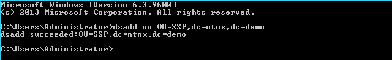

*Create the four users*

Creating the users is quite simple. Again open an elevated CMD window and run the folling command per user ``dsadd user cn=<USERNAME>,OU=SSP,dc=demo,dc=ntnx -pwdneverexpires yes -disabled no -pwd "nutanix/4"``. Exchange **<USERNAME>** for *SSPAdmin, SSPUsers, SSPUser1, SSP-AD-Query*. That should lead to the following screen after you have run the command.

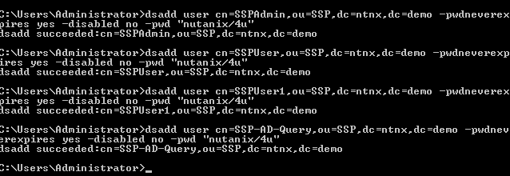

*Checking that all went OK*

Open the Active Directory Users and Computers tool. Check that the SSP OU and the four users are available.

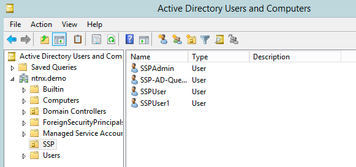

Now to check that the password have been accepted as used in the command earlier when the users where created and to test RDP, start the Remote Desktop Connection tool. MAke a connection to 127.0.0.1 and provide one of the users as credentials.

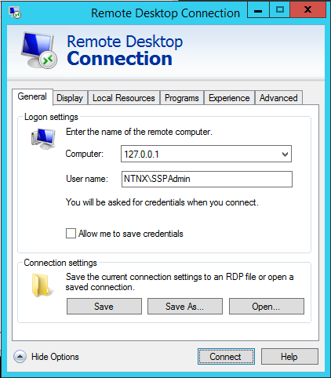

Provide the password for the defined user.

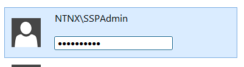

If all went well you get a warning error about certificates. This means the defined parameters worked. Your VM should now be ok for the workshop.

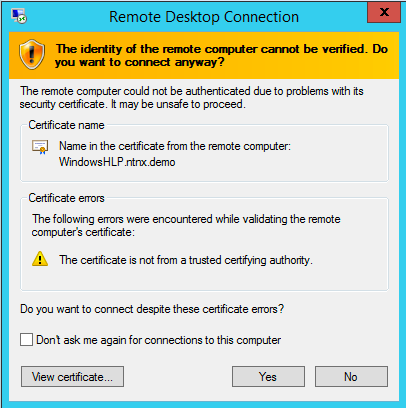

**VyOS**

For `VyOS <https://wiki.vyos.net/wiki/VMWare>`_ you download it. Start it for the configuration. Setup the following parameters:

#. Interface eth0
#. Interface eth1
#. SSH Services
#. Routing
#. Forward RDP to the Windows server
#. Some other stuff like DNS etc.

*Configure Interface eth0 (The Outside World)*

This interface is the interface where the attendees will be to make the connection to the environment.

Log in to the VyOS from the console using **vyos** and **vyos** as the default username and password.

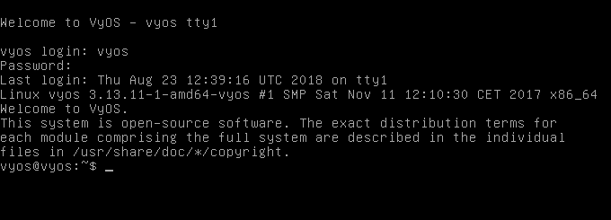

.. _vyosconfig:

.. note:: The follwing commands are an example and uses the outside world IP address (eth0) as 192.168.1.99. Make sure you **know your range** that you can use. Per environment you need **one IP address** that attendees can connect to.

After loging in, run the following commands

#. Go into configuration mode ``config``
#. Stop DHCP client on the eth0 interface ``del interface ethernet eth0 address dhcp``
#. Setting the external IP adrress of the VyOS router ``set interface ethernet eth0 address 192.168.1.99/24``
#. Setting the internal IP address of the VyOS router ``set interface ethernet eth1 address 192.168.81.254/24``
#. Configuring the SSH service and starting it ``set service ssh port 22``
#. Configure the static default gateway of the oudside world ``set protocols static route 0.0.0.0/0 next-hop '192.168.1.254'``
#. Commit the changes to the configuration file ``commit``
#. Check the running configurationof VyOS ``run show config`` now you must see the new IP addresses you just configured.

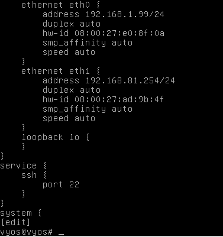

#. Save the configuration ``save``. This will save for a next reboot of the VyOS router so you don't have to retype everything.
#. Exit the configuration mode ``exit``.

At this stage you should be able ssh into the VyOS router on the defined eth0 IP address. In this example we defined 192.168.1.99. Use ``ssh vyos@192.168.1.99`` and use **vyos** as the password.

To make it easier for the rest of the configuration, download this file :download:`here <Scripts/vyosconfig.txt>`

and open it up in a text editor.

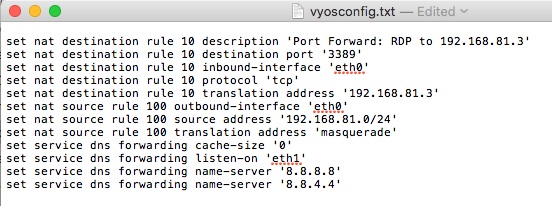

This file will set:

- the RDP forwarding to the Windows server
- DNS listener on eth1
- Forwards DNS queries to 8.8.8.8 or 8.8.4.4
- Masquerade all outbound traffic

In the ssh session to the VyOS router type the command ``config`` and hit **Enter** this will bring the VyOS in configuration mode again. Copy the content of the vyosconfig.txt file in the buffer of your machine by selecting all the text and hit **CTRL+C or Command+C**. Open the ssh terminal and paste the data in the ssh screen. After the paste has been done commit the changes to the configuration by issueing the command ``commit``.
The type the ``save`` command to save the config file so it keeps the configuration on a reboot and use the ``exit`` command to get out of the configuration mode.

 .. figure:: images/ilt_010.png

If all is now well, you should be able to issue the ``ping 192.168.81.3`` command and recieve replies from the Windows VM. If you don't make sure your VyOS and Windows VM are in the same network/VLAN on the ESXi server.

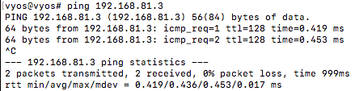

*Check RDP*

Now if all went ok start a RDP session to the external IP address of the VyOS router.

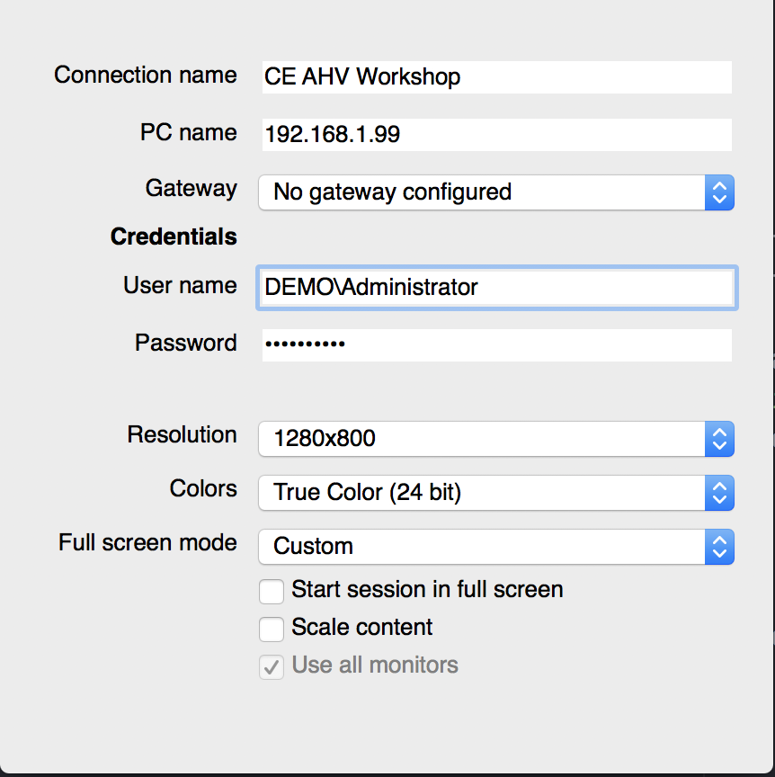

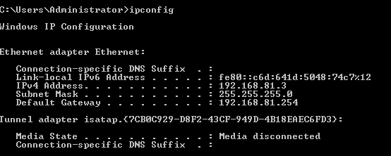

*Save the VyOS config for reusability*

.. note:: To save the full configuration use the following command sequences fram a ssh session ``show config comman`` this will list all the commands that you can reuse (copy and save to a text file) after you have setup the first steps (IP address and ssh service as mentioned here vyosconfig_)

**CE installation**

As installing CE nested in an ESXi enviroment is well documented, this document will only provide a URL where the procedure can be found. `Installing CE in a nested VMware ESXi environment <https://www.viktorious.nl/2018/05/03/run-nutanix-ce-nested-on-vmware-esxi-6-5-solving-some-of-the-challenges-you-will-face/>`_

**This concludes the creation from sratch of the AHV workshop.**

Pitfalls
+++++++++

- Create the CE environment everytime from scratch.
- Make sure the VLANs are defined in the ESXi network environment
- Make sure that the ESXi hosts are running in promiscious mode on the networks. Prefferebly on the vSwitch
- If running ESXi 6.5, test before freeing up to attendees
