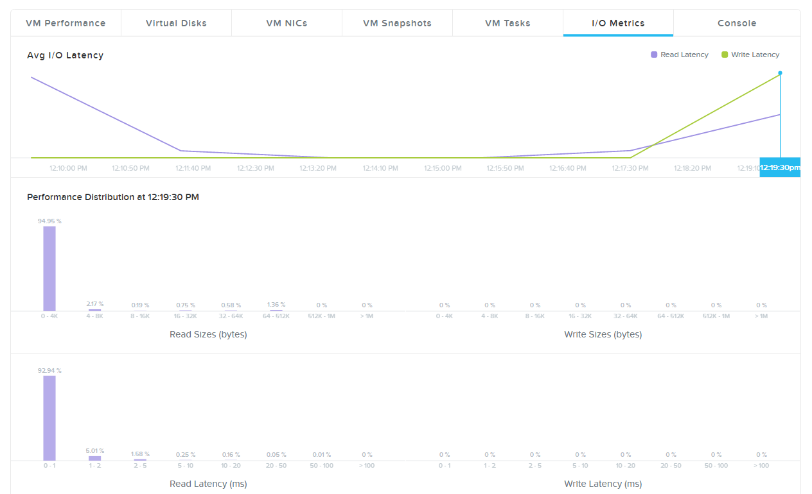

.. Adding labels to the beginning of your lab is helpful for linking to the lab from other pages
.. _io_metric:

---------
IO Metric
---------

Overview
++++++++

IO Metric is a way to see what the IO distribution is for the VM. Also it can be used to see the latency and maybe the root cause for issues with a particular VM that is part of an application.

------------------

Use IO Metric
+++++++++++++

During the installation of the Ubuntu server write and read actions will take place. The I/O metrics show what these reads and writes are.

Select the **ub-srv-<cluster-name>** and select the **I/O metrics** tab. The below screens show what happens during install

After having provided all the parameters and Ubuntu is being installed the below screens appear. During the installation of the Ubuntu server select OpenSSH server and hit continue to run the packages for the openssh server installation.

If the machine is done with the installation. Power off the Ubuntu server.

-------------------

Takeaways
+++++++++

- Easy visualization of issues with respect to disk operations.
- Root cause analyses on slow applications based on multi layer applications.
