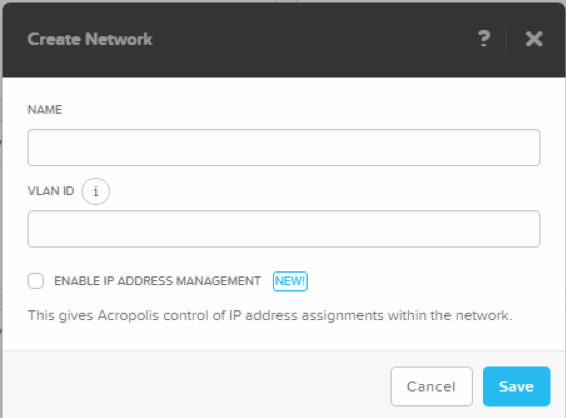

.. Adding labels to the beginning of your lab is helpful for linking to the lab from other pages
.. _network_conf:

---------------------
Network configuration
---------------------

Overview
++++++++

To have VMs talking to the outside world as well as to eachother, we need to configure networking. This module is about how to setup networking and have a managed network configuration to it.

Create a virtual network
++++++++++++++++++++++

While still in the PRISM interface, if not open *https://<NUTANIX-CLUSTER-IP>:9440* in your browser to access Prism and log in as a user with administrative priveleges,
change the View to **VM** and click **Network Config** on the right side of the screen. We need networking, so we need to create virtual networks first.

.. #TODO: Need to check the right screens due to backend of VM end networking has been introduceed since 5.5. Also the network configuration screen has changed. id:4
 ----
 <https://github.com/wessenstam/CE-ahvworkshop/issues/24>
 Willem Essenstam
 willem@nutanix.com

.. figure:: images/0.png

In the **VM** screen hit the **+ Create Network** button to create a new virtual network.

Fill the needed fields (use the below value as an example):

**Name: vlan0**

**VLAN ID: 0**

Check the **ENABLE IP ADDRESS MANAGEMENT** checkbox to see what else can be configured in the virtual network. Use again as an example the values in the screenshots

.. note:: Only use **one** IP address in the *DOMAIN NAME SERVERS (COMMA SEPERATED)* field!

To create a DHCP-Pool in the virtual network, click the **+ Create Pool** button and use the below values again as an example

When done, click the **Submit** button

The screen should now look like the below screenshot. Now click the **Submit** again to get the virtual network created in the AHV environment including the define DHCP settings.

.. note:: The DHCP settings will only be available in the virtualized environment. Other machines outside of the cluster will **not** recieve any DHCP IP addresses from the defined scope.

From the top a screen should drop down to tell that the network has been created, and the **Network Configuration** screen should show the just created network with its UUID and name. If you want to change anything just click the Pencil Icon right to the name of the virtual network.

Create at least three extra networks for VLANs 10,21 and 100 using the above methods. Just create the network using the default settings.

.. note:: After creating the networks, all network configurations will be \"pushed\" to all the current and new AHV nodes in the cluster. **Nothing** needs to be done.

-----------------------------------------------------

Takeaways
+++++++++

* Ease of creating

  - networks in AHV

  - a DHCP server and corresponding scope

* Ease of modifing

  - The DHCP scope

  - VLAN of the created network

.. #TODO: Check this changing Takeaways! id:1
 ----
 <https://github.com/wessenstam/CE-ahvworkshop/issues/21>
 Willem Essenstam
 willem@nutanix.com
