.. Adding labels to the beginning of your lab is helpful for linking to the lab from other pages
.. _example_lab_1:

-------------
Network Visualization
-------------

Overview
++++++++

One of the issue with networks and vlans is that troubleshooting can be a difficult thing. Where is the issue to be found? Using the Network visualisation in PRISM on AHV you can see from VM to the TOR switch what the VLAN are, which VM is running on which host and how the host is connected to the switch on which port.
This module is trying to explain how it is set up and how to use it. As we will be using a virtual switch we can’t see on which port the host is connected. But we can see if the VLAN’s are available on the switch.

Open **https://<NUTANIX-CLUSTER-IP>:9440** in your browser to access Prism. Log in as a user with administrative priveleges.

Select Network in the dropdown to go to the Network Visualization page

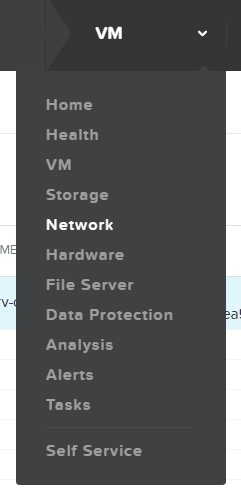

As we already added a switch in the beginning of the workshop, that switch is shown and connected to the host.

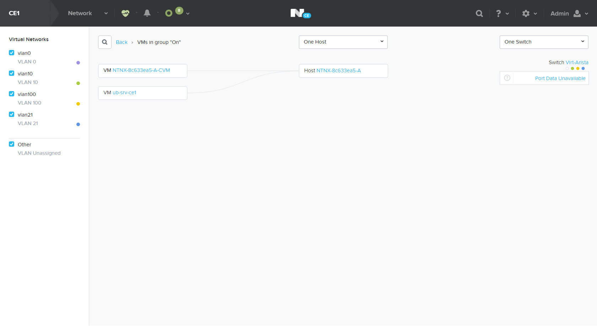

Left hand side of the screen shows our earlier created VLANs. On the right hand side you’d see the VM’s, the hosts and the switch. The switch shows the VLANs defined. PRISM uses colored dots to show the VLANs.
If you click on one of the VMs, below is the CVM, you see the network traffic, dropped and errors on the NIC.

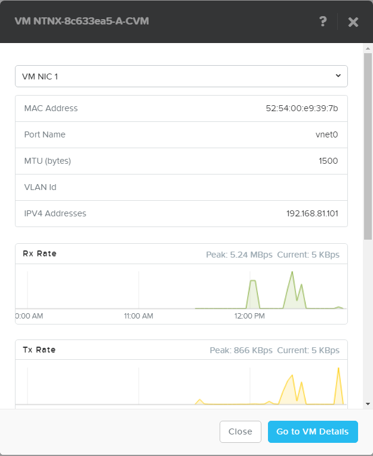
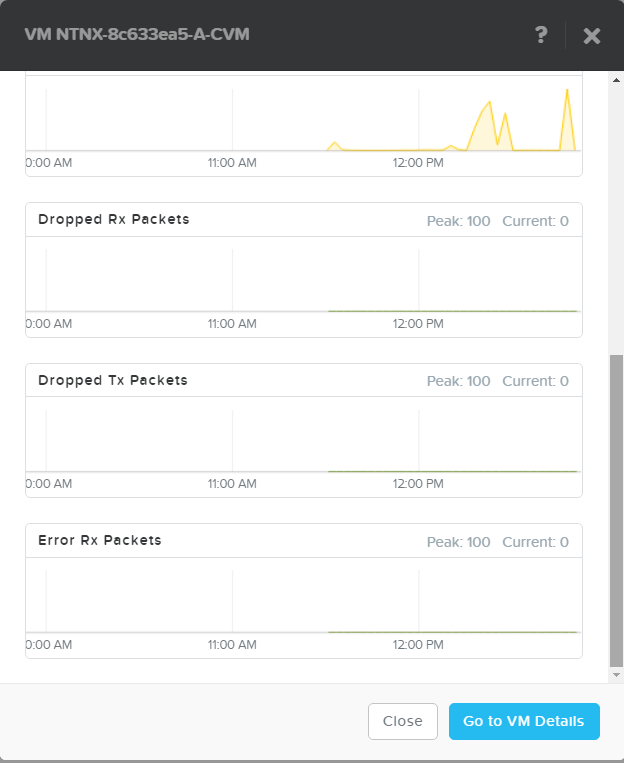

On the created Ubuntu server, we are going to add a NIC in VLAN21
After clicking on the VM, click the Go to VM Details button to open the VM settings. Let’s add a NIC.
Click on the +Add New NIC button

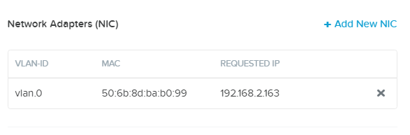

Create a NIC in the vlan21 network and click **Add**

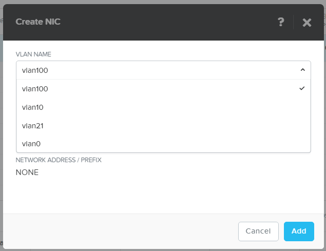

A new task is being shown in the top bar. Wait untill that turns green.

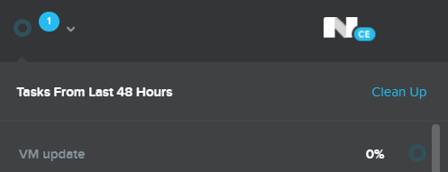
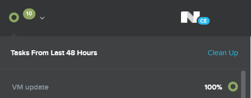

Return in the VMs table. Select our Ubuntu server and select the VM NICs tab to see it has two NICs

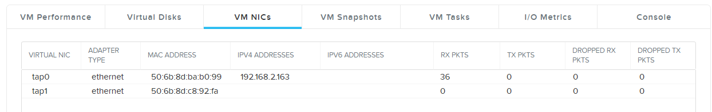

Return to the Network home view to check we now see the other colored DOT beside the VM. If it still shows up empty, hut Shift+F5 in the browser to do a refresh of the screen. This may happen due to a very limited amount of RAM assigned to the CVM.

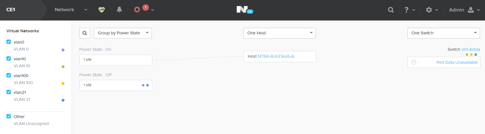

If you click the VM again in the Network Virtualissation, you can select the NIC in which you are interested.

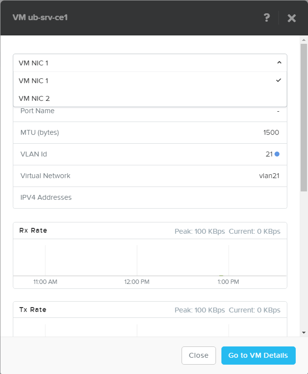

By using a filter in the right hand side of the middle screen, you can choose to look at Power State, Host or VM Type.

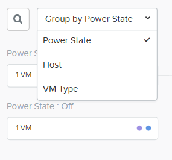

Also you can filter on host.

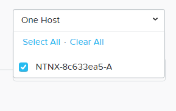

Or maybe see only one switch if it has been added to the cluster.

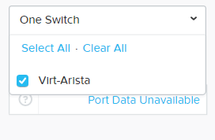

Takeaways
+++++++++

- Ease of showing how the VMs are connecting to the hosts and the outside world.
- See the amount of traffic that a VM is generating and receiving.
- See the CVM and host's network connectivity.
