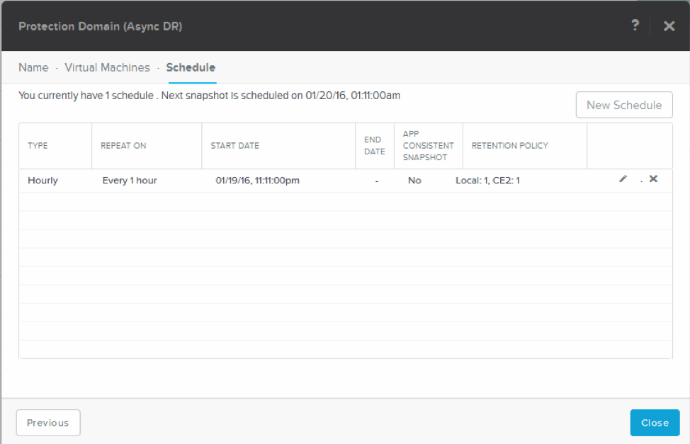
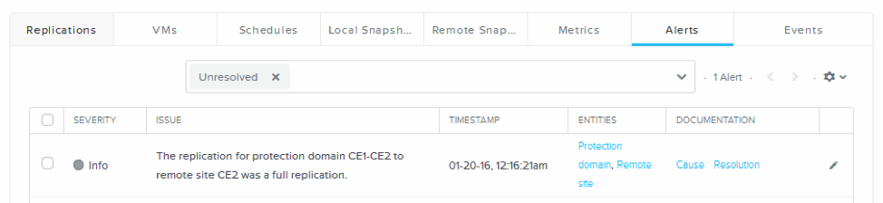

.. Adding labels to the beginning of your lab is helpful for linking to the lab from other pages
.. _replication:

-----------
Replication
-----------

Overview
++++++++

For this section you will be working with another cluster to start A-Synchronous replication using two CE installations. Use the below table to get the information needed.

=========== ==============  ======================  ==========  =========== ===========
Clustername IP Address CVM  IP Address Hyper-Visor  VM Name     Container 1 Container 2
=========== ==============  ======================  ==========  =========== ===========
CE1         192.168.81.31   192.168.81.21           ub-srv-ce1  vms-ce1     DR-vms-ce2
CE2         192.168.81.32   192.168.81.22           ub-srv-ce2  vms-ce2     DR-vms-ce1
=========== ==============  ======================  ==========  =========== ===========

We start by creating a Remote Site and then a Protection Domain.

During this module we will perform:

- Create a remote site
- Create a Protection Domain (PD)
- Test the replication by taking a snapshot
- **TBC:** Restore the VM on the receiving CE cluster

Remote site setup
-----------------

To get A-Sync running we firstly need to define a remote site. Click on **Data Protection** in de main screen bar.

On the right-hand side click on the **+ Remote Site** and then on **Physical Cluster** as the sync partner is a “physical cluster”.

.. note:: The screenshots further on in this document use **CE1** as the source and the **CE2** cluster as the remote side for example reasons!

In the **Remote Site** screen type the information of the partner cluster. Give the remote site a name which makes it user friendly and provide the **ADDRESSES** of the partner cluster and click **Add Site**.

.. note::  In real live production environments use the **External IP address** of the cluster. In our demo environment we use the IP address of the CVM as we only have one node in the Nutanix Cluster. Make notice of the orange text in the **Remote Site** dialog!!!

The below dropped down screen should been seen.

The screen, after clicking on the **Save** button should show a green text stating that the Remote site has been created successfully. Scroll down and leave all setting default till you see **NETWORK MAPPING** and **VSTORE NAME MAPPING** as we need to tell the cluster how to map these two.

For **NETWORK MAPPING** we need to tell the cluster how to map the networks on both cluster to each other. This has to be done if the networks on both cluster are not named the same. In our environment we use the earlier created networks **AHV-vlan0** on both sides.

For the **VSTORE NAME MAPPING** we need to tell the mapping between **Source VStore** and **Destination VStore**. In our environments we need to change these to the below screenshot. Again use your parameters according to the table earlier. As *example* in the screenshot **vms-ce2 on ce2 is mapped to DR-vms-ce2 on the ce1 cluster**.

.. note:: **Now repeat these steps for the other CE2 cluster. Only then replication can work. So you need to create a "cross-link" between clusters**.

.. note:: Open both clusters in a browser with each cluster in its own screen or tab to make life easy.

After creation of the Remote Site the below screenshot should be shown where you see the settings which you have created earlier. If you don’t see this, click on the **Table** view and then on **Remote Site**.

After selecting the Remote Site you just created you should be able to use the **Test Connection** button. If you’ve created the remote site correctly, you should see a green checkmark left to the button like below screenshot.

Creating a Protection Domain
----------------------------

When clicking on the **Async DR** button there should not be shown anything.

.. figure:: images/12.png

On the right hand-side of the screen click on the **+ Protection Domain** and the on **Async DR**.

A new screen appears in which a name is asked for. Give the **Protection Domain** a useful name like CE1-CE2 and click the **Create** button.

The next phase will be to assign VM’s to the **Protection Domain**. Select the **ub-srv-cex** VM which you created earlier and click on the **Protect Selected** VMs button.

 
This should end up in a screen like below.

Click the **Next** button.

Now we need to tell the cluster according to which schedule it has to make snapshots and should they be replicated to another remote site. Click the **New Schedule** button.

Try to create a repeatable time smaller than 60 minutes like below.

This should return an error as soon as you click on another parameter in the top of the schedule.

.. note:: The lowest number which can be set in the minutes is 60 minutes!

Set the parameters according to above screenshot and click the **Create Schedule** button.
This should result in a screen just like below.

Click the **Close** button to close the creation of the Protection Domain.
 
Test the Replication
--------------------

To test all simple click on the **Async DR** button and select the protection domain we’ve just created.

The **Take Snapshot** button should now be available. Click this button.

Now let’s create a snapshot of the VM in the selected protection domain and set the settings to the below screenshot.

This will result in a snapshot be create, replicated to the remote site, scheduled now and with a retention of 1 day. Don’t forget to select the **REMOTE SITES** otherwise there will only be a local snapshot created. Click on **Save** when done.

That click should show a notification stating that the schedule has been created.

Select the protection domain again and then look at the **Replications** tab. There should be a line stating what it is doing.

If the replication has worked and is completed, there will be in the same tab of **Replications** a mentioning of this lower in that subscreen. Example is below.

Take a look at all tabs which are available.

VMs tab

Schedules tab

Local Snapshots tab

Remote Snapshots tab

Alerts and Events tab.

If it didn’t work, use the Alerts tab to see what is wrong.

On the left hand-side of the bottom half of the screen you will find Summary information of the protection domain.

-------------

Takeaways
+++++++++

- Easy setup of Protecting VMs and replicating between clusters in different GEOs
- VM based replication. Not storage based.
- Easy rotating possibilities between local and remote snapshots
