.. Adding labels to the beginning of your lab is helpful for linking to the lab from other pages
.. _ssr:

--------------------
Self Service Restore
--------------------

Overview
++++++++

Backups are very important for organisations all over the world. To quickly restore data you can use the snapshots that can be created with the solution. One of the ways to recover data is using the Self Service Restore feature that is built-in the Nutanix Guest Tool (NGT). This NGT has been installed on the Windows server in an earlier stage of the workshop. If you haven't done so, please make sure that you install the NGT before moving forward with the module. The NGT install can be found in the VM Creation module under the `Create Windows VM part <../VM/vm.html#winvm>`_

SSR Tool
--------

Login into the Windows VM that we created earleir in the workshop and the NGT tool has been installed.

Open the Nutanix SSR tool by double clicking on the Icon on the desktop of the Windows VM

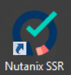

A login screen should appear. Login as the local **administrator** and password of **nutanix/4u**.

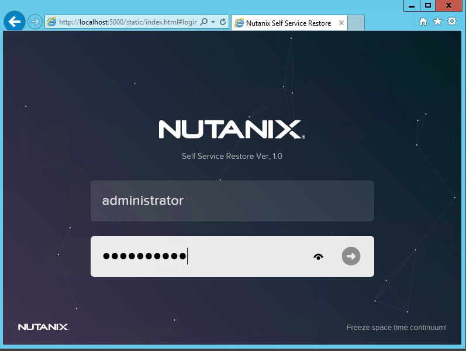

A **“error” screen** should appear that the VM is not protected and has no snapshots available yet.

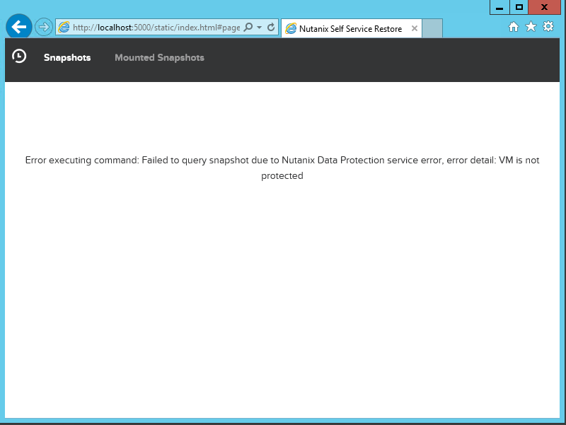

Close the web browser screen.

Create snapshots
++++++++++++++++

To create snapshots we have to define a Async DR. This way we create snapshots of VMs in the cluster. These snapshots can then be used by the SSR tool.

In the PRISM interface, click on the home button and change to **Data Protection**.

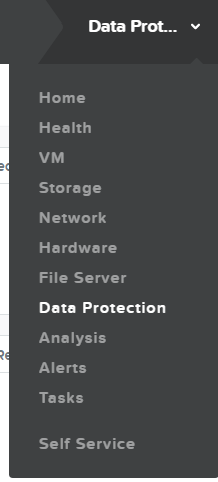

Click the **+ Protection Domain** and then **Async DR**.

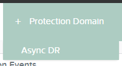

Fill out the requested fields as mentioned below:

- Name of the protection Domain: **SSR-Test**
- VM to be protected: **Select your Windows VM**
- Schedule: **Repeat every 60 minutes; keep 2 local snapshots**

Click the **Table** "tab" in the **Data Protection** view. The created Protection Domain (PD) named **SSR-Test** should be shown with a green icon left to it.

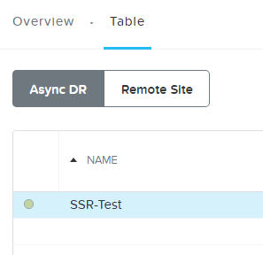

When selecting the SSR-Test Protection Domain (PD), select the Entities Tab (half way the page) which should show your Windows VM.

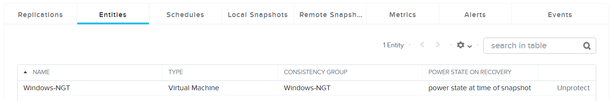

The Schedule tab should show your created schedule

.. figure:: images/ssr_0018.png

On your Windows VM, create a text file and place it on the desktop. Open the file and provide some content in the file.

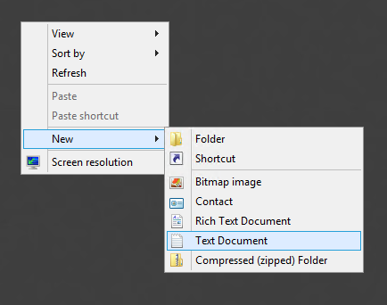
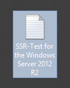

Return to the PRISM interface and click on the **Take Snapshot** button

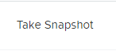

In the new dialog, select the **RETENTION TIME** and set it to 1 Day.

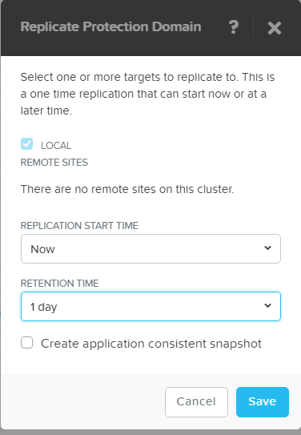

Click on **Save**. A new Snapshot will be created. To see all the snapshots, select the **SSR-Test** PD and click on the **Local Snapshots** Tab.

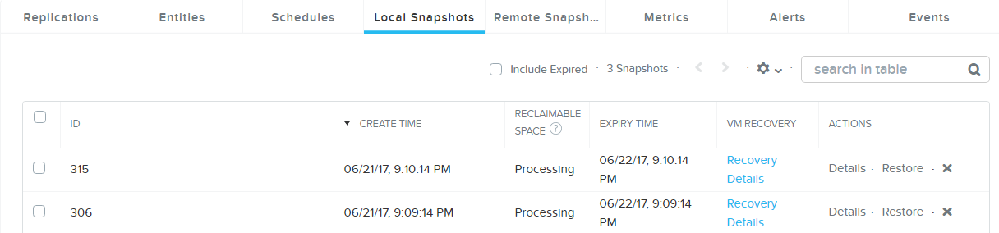

In the Windows VM delete the earlier created txt file and empty the Recycle Bin.

Reopen the Nutanix SSR interface. This should now show up with the same amount of snapshots as seen in the PRISM interface.

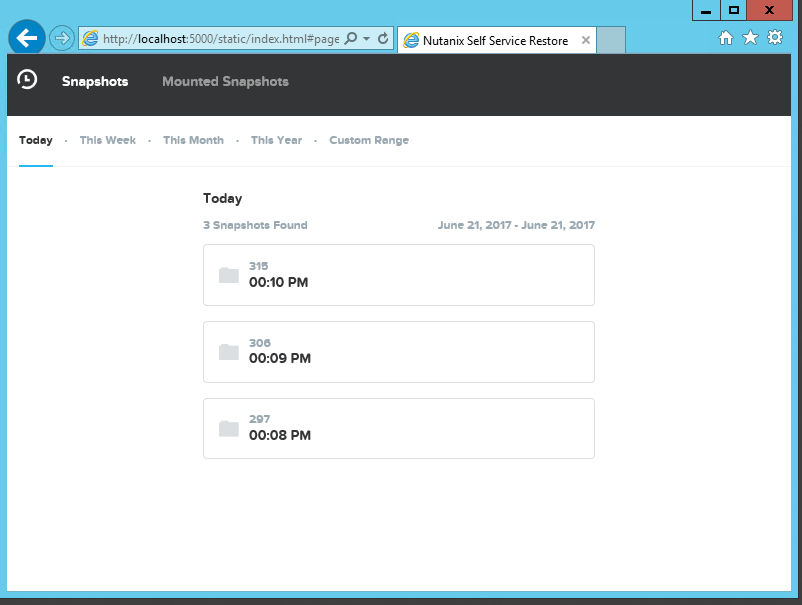

You can also see which sanpshots are available for this week or longer periods by clicking on the periods buttons in the top bar of the screen. The below shows the week as the period.

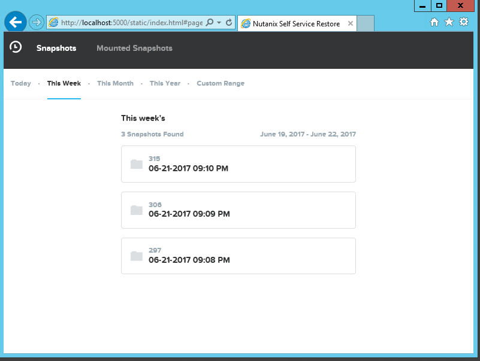

Select the last snapshot to restore the deleted file. Check the **Disk 0**

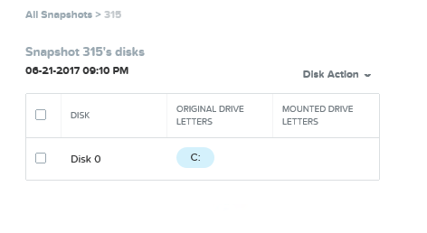

Click on **Disk Action** and select **Mount** from the dropdown box and wait for a few seconds to have the drive mounted.

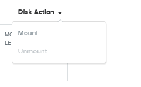
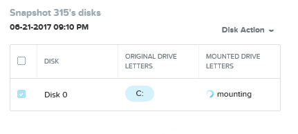

After a completed mount the drive will be shown as another drive letter on a green background.

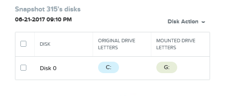

Open the Windows Explorer and navigate to G:\\Users\\Administrators\\Desktop to drag and drop your deleted txt file back to the desktop.

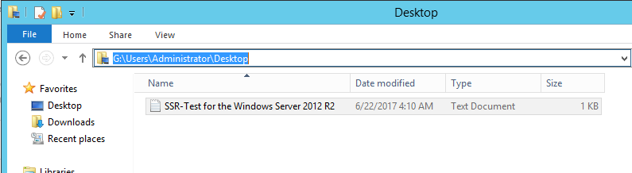

Open the file and make sure you have the same file restored by checking the content.
Change the “backupped” txt file.

While in the Explorer, open the “backupped” txt file and make some changes to the content of the file. Save the file as you would normally do.

Return to the Web Browser and unmount the drive by selecting the **Unmount** from the **Disk Action** menu after selecting the **Disk 0**.

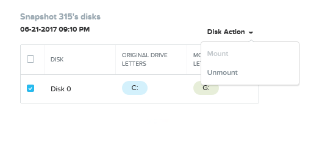

Remount the drive using the earlier steps and see what the content of the txt file is.

``Can you provide a use case for this kind of action??``

Unmount the drive again so we don’t use to much resources in our small environment.

--------------

Takeaways
+++++++++

- Easy process of mounting snapshots
- Easy restore files from snapshots
