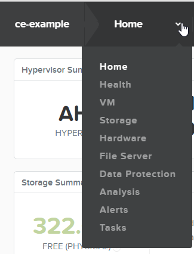

.. _storagebasic:

-------------
Storage tasks
-------------

Overview
++++++++

The first to be taken to put information on the Nutanix cluster is do define storage.

Create a StoragePool
++++++++++++++++++++

**Step 1** is to create a StoragePool. This will combine all drives (SSD and HDD) into a pool.

Open *https://<NUTANIX-CLUSTER-IP>:9440* in your browser to access Prism. Log in as a user with administrative priveleges.
To start the first step, click **Home** on the top of the screen and select **Storage**.

As your enviroment has already be created, you should already see a storagepool.

-----------------------------------------------------

Create a (Storage) Container
++++++++++++++++++++++++++++

**Step 2** in the process of creating storage which can be used by our to be created VMs is to create a Storage Container or short Container.

In the overview screen click on + Container to create a container.

Name the container according to the earlier mentioned table in the naming convention ``<clustername>``. Below is a screenshot of the cluster ce.

.. figure:: images/4.png

Click on the Advanced Settings button to see other parameters that can be set on a per container bases. Just have a look at all the options you can tick.

.. note:: Keep the settings to default as the demo is running CE with limited resources during this workshop.

Click **Save** to have the container created.

Cretae a second container for the replication part of this workshop according to the same table as mentioned earlier, for the replication partner.
Naming convention should be: ``DR-vms-<clustername partner>``.

The below screenshot is using the ce2 cluster as its replication partner.

Lastly create a container called **ISOs**, using the default settings. This ISOs container will be used to upload ISO images that are going to be used later in the workshop.

.. note:: THIS CONCLUDES STORAGE RELATED SECTION OF THIS DOCUMENT

-----------------------------------------------------

Takeaways
+++++++++

- Ease of use with respect to creating and assinging storage to a Hypervisor.
- Possibilities on the container and how the system should store the data it receives from the VMs in the Container.
