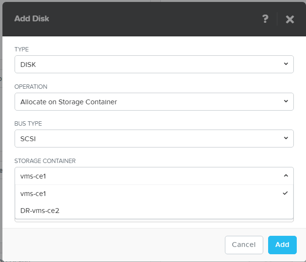

.. Adding labels to the beginning of your lab is helpful for linking to the lab from other pages
.. _vm:

-------------
VM Creation
-------------

Overview
++++++++

In this part of the lab you are going to create two VMs. One Linux and a Windows VM. You will see the differences between these two O/S installation processes.

Creating a VM in AHV
++++++++++++++++++++

Back in the VM view, click the **+ Create VM** button on the right side of the screen

Creating a Linux VM
+++++++++++++++++++

The below screen will pop up. Use the values in the screenshot for your VM you going to create. For the name please use the following namingconvention:
*ub-srv-<name of the cluster>* example for cluster ce1 ub-srv-ce1 as shown below.

Define a disk so we can write data to the VM. Click the **+ New Disk** button to create as many disks as we want for the VM. You can only create one at a time.

Change the container to the one we’ve created earlier. If you haven’t created it, Cancel this action and go to the **Storage View** and create a container quickly. Name it **vms-<clustername>**. As an example on cluster 1, called CE1, you create a container called vms-ce1, and return to the VM creation and disk creation screen like above.

Create a 10GB disk in the right container.

Click the **Add** button to add the just defined disk.

Now let's change the CD to something useful instead of an empty one. Click on the **pencil** icon just right to the CDROM.

.. figure:: images/Sizer0018.png

A new screen will appear. Change the **OPERATION** into **CLONE From Image Service**

As there is no ISO image yet in the cluster, we need to upload one. Click the **Add Image** text.

A new screen pops-up. Click the **+Upload Image** button.

Give the too be uploaded ISO a name which is easy to understand what the image is all about. As an example use the below parameters and change the **IMAGE TYPE** to ISO like below. Also make sure you use the right container and select the **Upload from file** radio button and click on **Choose File** to locate the right ISO to be uploaded.

Click the **Save** button to upload the ISO file into the cluster. The below screen will appear to show the progress of the upload.

In the top bar a donut will appear to indicate the upload of the image. Wait untill it is green and the **Image Configuration** screen show the ISO file you just uploaded and status **Active**.

Now you can use the ISO file for installation of a VM. Back to the VM, change the *IMAGE* field into the just uploaded ISO file.

Click the **Update** button to return to the VM definition.

If you want to change uploaded ISO images after creation of the VM, click on the gear-icon in the top right hand corner and select **Image Configuration**.

As this is an example we are going to use the earlier created virtual network. Click **Add New NIC** to add a network connection to one of the created virtual networks

Leave all fields default as we want to have a DHCP IP address on this NIC. Click the **Add** button to add the NIC to the VM.

After that you will see in the VM definition the below screen.

To have the VM running on specific host, you can use the **Set Affinity** button. After clicking this you will see the possible hosts available for this VM. By selecting the host you are telling the cluster to run the VM on only those hosts.

Now click the **Save** button to have to the VM be created. From the top bar a notificzation should popup to show that the cluster has recieved a task to create a VM.

In the Table view of the VM view, you will see your newly created VM.

Now let's start the VM. Select the VM first. Hit the **Power On** text/button halfway the page.

If the machine is started you will see a green icon left next to the VM's name.

Also after the VM has started you will find on which host it is running. Not sooner.

If you click on the **Launch Console** button a popup VNC screen will appear, unless popup blocker is active, and you will see the console of your VM.

If yuo want, test all the buttons the righthand side of the VNC console to see what they do.

.. figure:: images/Sizer0043.png

Run the installation. The machine will be used at a later stages of the workshop.

Creating a Windows VM
+++++++++++++++++++++

Before we can start creating the Windows VM, we need to upload two ISO images first into the cluster.
Open the **Image Configuration** page.

Follow the earlier process while creating the Linux VM to upload two files (location is provided by the instructor):
1. Windows 2012 R2 ISO image
2. VirtIO driver ISO image

The later ISO image is needed to provide the Windows installer media the right drivers to access the drive we will create. As AHV uses a KVM bases, we need to provide de VirtIO drivers. Microsoft doesn't have these on board on the installation media.

After you have uploaded the two ISO images you can proceed to create the VM like the Linux VM earlier.
Create the Windows VM with the following parameters:
1. **NAME**: WinVM-<CLUSTERNAME>
2. **vCPU(s)**: 1
3. **Number of Cores per vCPU**: 2
4. **Memory**: 2GB
5. **NIC**: 1, assigned to one of the earlier created networks
6. **Disk**: 40GB
7. **CDROM-1**: Windows 2012 R2 ISO; Clone from Image Services
8. **CDROM-2**: Nutanix VirtIO ISO; Clone from Image Services

After saving the VM, start it and click the **Launch Console** button after the link because active.

During the installation of Windows, click on the **Load Driver** button to load the drivers needed to recognize the "hardware".

Click the **Browse** button, select the Nutanix VirtIO driver CD and navigate to the Windows Server 2012 R2 Directory and click on **OK**.

.. figure:: images/Sizer0045.png

Select all drivers that show up and click on the **Next** button. Now you can select the 40GB drive and finish the installation of the Windows 2012 R2 server. When prompted for the password of the administrator account, use **nutanix/4u**.

After installation of the O/S, we need to install the Nutanix Guest Tools (NGT). To do this, go back to PRISM and select the VM. Then click on the **Manage NGT** text. A new screen will appear.

Select the options as mentioned in the screenshot. If the error message appears as mentioned in the screenshot, click on the **Unmount Current ISO** to empty one of the CDROM drives. The settings are important for later parts of the workshop.

Back in the Windows server, using the console, install the NGT using the default installation options.

After the installation has finished, click the **Close** button. On the desktop of the Windows Server, there should be a new icon called **Nutanix SSR**. This tool will be used in a later stage of the workshop.

----------------------

Takeaways
+++++++++

- Full control of the storage, networking and Virtual Machines from PRISM
- Installation of VMs are easy to do.
- Uploading of ISO images are easy to do from files and URLs
