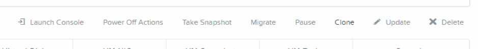
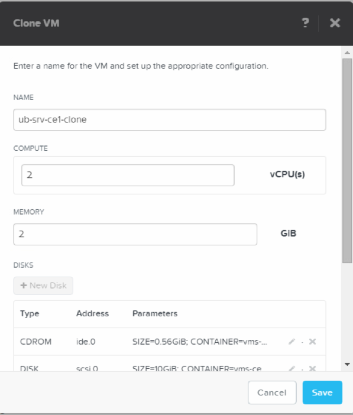
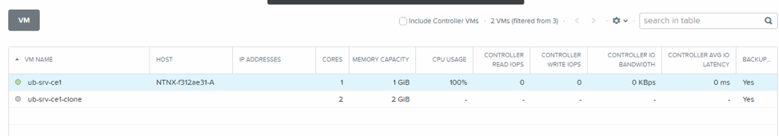
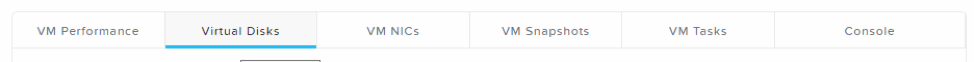

.. Adding labels to the beginning of your lab is helpful for linking to the lab from other pages
.. _vm_clone:

----------
VM Cloning
----------

Overview
++++++++

This part of the workshop is showing how you can clone VMs via the PRISM interface. In a later stage of the workshop we will be cloning VMs using a script.

-----------

Clone a VM
++++++++++

Let’s clone a VM using the PRISM interface. Click the **Clone** button kin the PRISM interface.

Use the below settings for the clone use for the name the original name and add **-clone** to it. Look at all options you can change!

After you have clicked the **Save** button the VM clone should appear in the PRISM UI like below.

Look at all the options you can monitor after you’ve clicked on one of the VM’s. Information should be there for the first created and powered-on VM.

Takeaways
+++++++++

- Easy cloning using the interface and changing characteristics for the clones
- Fast cloning of VMs with defined parameters
