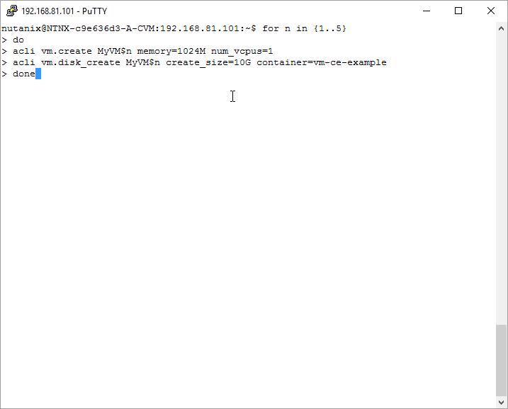
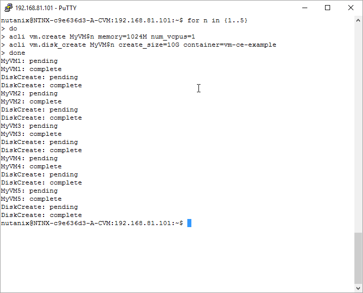
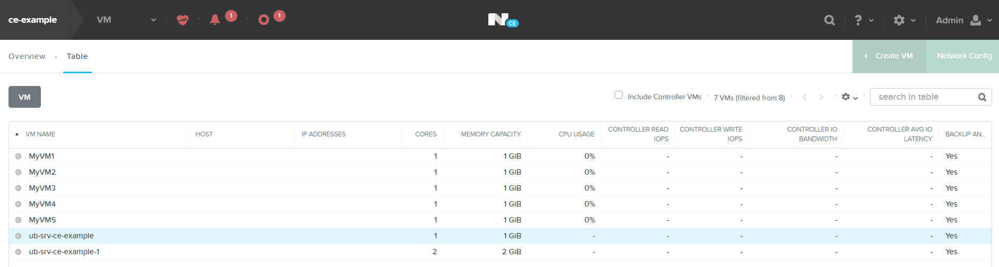
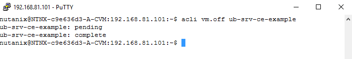
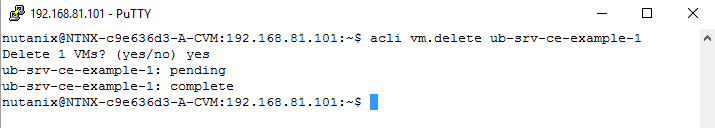
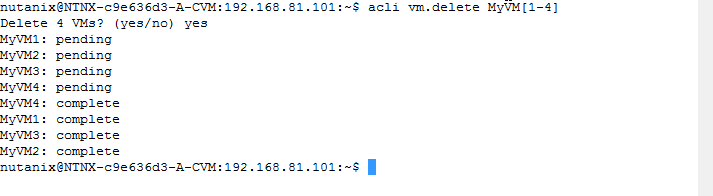
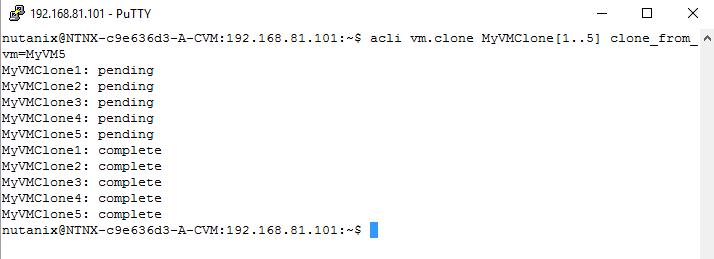
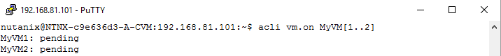

.. Adding labels to the beginning of your lab is helpful for linking to the lab from other pages
.. _vm_script:

---------------------------
VM manipulation via scripts
---------------------------

Overview
++++++++

AHV is very powerful from a scripting interface the so called **acli**. The flowing section is providing some basic scripts/commands that can be used in the **acli** interface.

During this module you'll be:

- Creating a VM using a script
- Cloning a VM using a script
- Manipulation of VMs via a script

VM Creation
-----------

Connect to the CVM using the IP address of your cluster by using Putty. Use **nutanix** and the **nutanix/4u** as username and password combination.

After the connection is successful type the following command to create a VM with 1GB of RAM, 1 vCPU and a 10GB disk. For demo purposes the CDROM and the NIC are not used but can be added if wanted.

``for n in {1..5}
do
acli vm.create MyVM$n memory=1024M num_vcpus=1
acli vm.disk_create MyVM$n create_size=10G container=vms-ce1
done``

This command should lead in having 5 VM’s named MyVM1 to MyVM5 all with the earlier mentioned parameters. The below screen shows all lines returned by the cluster.

.. note:: For a full reference to all acli command’s look in the `Application Mobility Fabric guide <https://portal.nutanix.com/#/page/docs/details?targetId=Command-Ref-AOS-v58:man-acli-c.html>`_ on the support site.

PRISM will show all just 5 newly EXTRA created VM’s

 
VM Cloning
----------

Before we can clone machines, we need to get some resources freed-up. So power done the earlier created clone using the UI named ub-srv-cex by using the ``acli vm.off`` command

The PRISM should show a gray coloured icon infront of the VM like below.

.. figure:: images/vmscript_008a.png

Now let’s delete that VM by using the ``acli vm.delete`` command and reply yes to the asked question if you are sure.

Also delete all earlier created MyVM1 till 5 using the ``acli vm.delete MyVM[1-4]`` command like below and reply with yes as well.

In the PRISM UI the VM’s should be gone except for two.

.. figure:: images/vmscript_008a.png

No let’s clone the MyVM5 into 5 new machines called MyVMClone1 to MyVMClone5 by using the ``acli vm.clone`` command as shown below.

PRISM should show

Let’s power on the first two just created VM’s by using ``acli vm.on MyVMClone[1..2]`` command. PRISM should show the VM’s with a green ball in front of the VM.

Now let’s delete all earlier created VM by using the ``acli vm.delete MyVMClone*`` command using wildcards and answer the question asked with yes.

Only one VM should exist in the cluster.

-----------

Takeaways
+++++++++

- Here is where we summarize any key takeaways from the module
- Such as how a Nutanix feature used in the lab delivers value
- Or highlighting a differentiator
